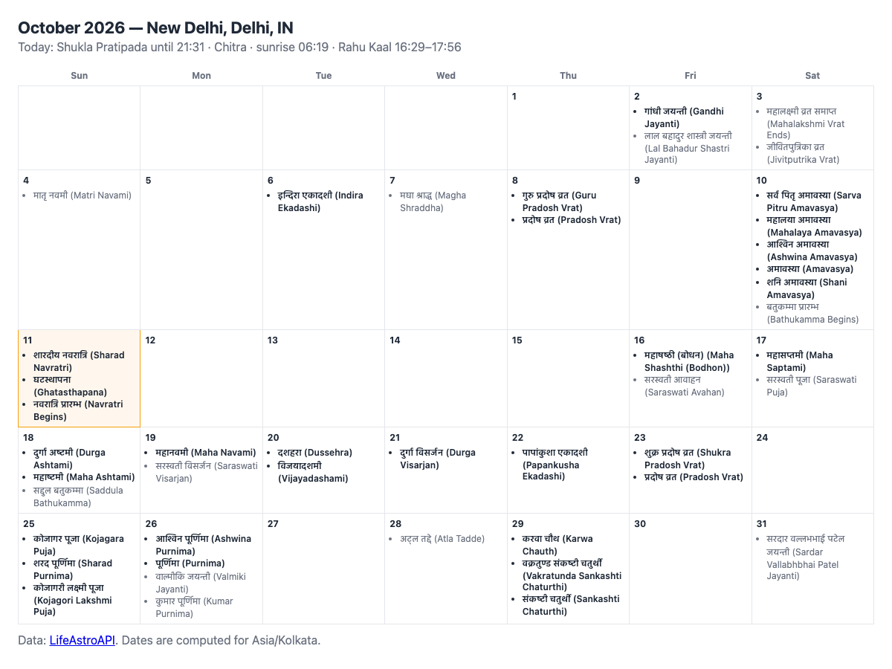

# Hindu calendar for any city

A small TypeScript program built on the [LifeAstroAPI Node SDK](https://www.npmjs.com/package/lifeastroapi). For any city it prints:

- **today's panchang**: tithi, nakshatra and yoga with the time each ends, sunrise, moonrise and Rahu Kaal;
- **this month's festivals**, each with the window that decided its date (pradosh kaal, moonrise, aparahna …);
- **the next Ekadashis** with their parana (fast-breaking) window.

With `--html` it also writes `calendar.html`, a month grid you can open in a browser.



## Run it

You need Node.js 18+ and a free API key from [lifeastroapi.com/signup](https://lifeastroapi.com/signup/).

```bash
npm install
export LIFEASTRO_API_KEY=dv_live_...

npm start -- --city Toronto
npm start -- --city Chennai --amanta          # amanta month names (South, West, East India)
npm run html -- --city "New Delhi" --locale hi  # Hindi names + calendar.html
```

| Option | Meaning |
|---|---|
| `--city <name>` | Any city name; the first match from `/v1/geo/search` is used. Default: New Delhi |
| `--locale <code>` | Festival names alongside English. `hi` covers every festival; `mr`, `ta`, `kn`, `bn`, `gu` and `pa` give the regional name for the main festivals and fall back to Hindi elsewhere |
| `--amanta` | Amanta month naming instead of purnimanta |
| `--html` | Also write `calendar.html` |

## Sample output (Toronto)

```text
Toronto, Ontario, CA  ·  America/Toronto  ·  Sat, 10 Oct 2026

Today
  Saturday, Ashwin Krishna paksha (purnimanta)
  Sunrise 07:25   Sunset 18:42   Moonrise 07:27
  Tithi      Amavasya until 11:50
  Nakshatra  Hasta until 12:12
  Yoga       Indra until 12:32
  Rahu Kaal  10:14–11:39

Festivals this month (31)
  Fri, 2 Oct     Gandhi Jayanti
  Tue, 6 Oct     Indira Ekadashi   [parana next day 07:22–11:11]
  Wed, 7 Oct     Budha Pradosh Vrat   [pradosh kaal 18:48–20:24]
  Wed, 7 Oct     Pradosh Vrat   [pradosh kaal 18:48–20:24]
  Fri, 9 Oct     Sarva Pitru Amavasya   [aparahna 14:12–16:28]
  Fri, 9 Oct     Mahalaya Amavasya   [aparahna 14:12–16:28]
  Sat, 10 Oct    Ashwina Amavasya
  Sat, 10 Oct    Amavasya
  …

Next Ekadashis
  Wed, 21 Oct    Papankusha Ekadashi   parana Thu, 22 Oct 14:49–18:23
  Wed, 4 Nov     Rama Ekadashi   parana Thu, 5 Nov 06:59–10:20
  Fri, 20 Nov    Devutthana Ekadashi   parana Sat, 21 Nov 07:19–10:29
```

Dates are computed for the city's own sunrise, moonrise and timezone, so the same festival can fall on a different day in Toronto than in New Delhi.

## How it works

[`index.ts`](index.ts) makes four calls, three of them in parallel:

| Call | Endpoint | Credits |
|---|---|---|
| City to latitude, longitude, timezone | `geo.search` → `/v1/geo/search` | free |
| Today's panchang | `panchang.advanced` → `/v1/panchang/advanced` | 30 |
| Festivals of the month | `festivals.month` → `/v1/festivals/month` | 20 |
| Ekadashis of the year | `festivals.vrat` → `/v1/festivals/vrat?type=ekadashi` | 30 |

About 80 credits per run; the free tier includes 1,500 credits a month. Errors from the API arrive as typed SDK errors (`LifeAstroError` with `status` and `code`, for example `insufficient_credits`).

Keep your API key on a server. This example runs in a terminal; in a web or mobile app, call LifeAstroAPI from your backend. See [Kundli API in a React Native app](https://lifeastroapi.com/docs/guides/kundli-api-react-native/) for that pattern.

## Learn more

- [Hindu calendar, festivals and vrat — how dates are decided](https://lifeastroapi.com/features/hindu-calendar-festivals/)
- [Festival API reference](https://lifeastroapi.com/docs/reference/festival/)
- [Free Hindu calendar pages for 22 cities](https://lifeastroapi.com/hindu-calendar/)
